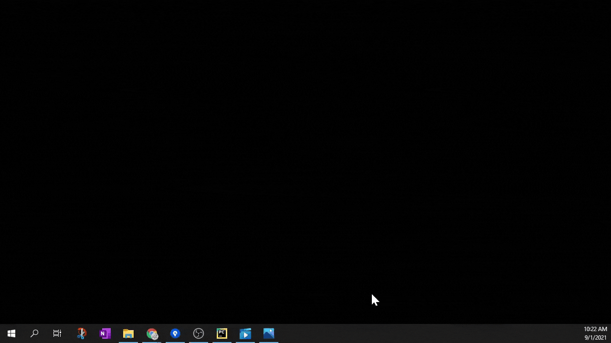

# DeskTranslate User Guide

## Contents page

* [Introduction](#introduction)
* [Quick Start](#quick-start)
* [Features](#features)
  * [Translation](#translation)
    * [Selecting languages](#selecting-languages)
    * [Selecting Borders](#selecting-borders)
    * [Auto Translate](#auto-translate)
  * [Customization](#customization) 
  * [Bonus Features](#bonus-features)
    * [Splash Screen](#splash-screen)
    * [Text Box Resizing](#text-box-resizing)
* [FAQ](#faq)

## Introduction

DeskTranslate is a desktop application for translating foreign texts using optical character recognition. 

It has 3 main features:

* Live-translation
* Text2Speech
* Customizable font sizes and colours

## Quick Start

1. To get started, download DeskTranslate at our main repo by clicking Code -> Download ZIP.

2. Ensure Python is install in your computer.

3. Using terminal, go to the directory where the repo is downloaded to. 

4. Download the libraries required:  
`pip install -r requirements.txt`

5. Next, enter the following command to start the program:
`python main.py`

## Features 

* DeskTranslate has a intuitive GUI that is quite easy to use, with a customizable display
* Included a splash screen, in-app user guide, and about us section as well

### Translation

#### Selecting Languages

#### Selecting Borders

#### Auto Translate

### Customization

### Bonus Features

#### Splash Screen

#### Text Box Resizing

## FAQ

